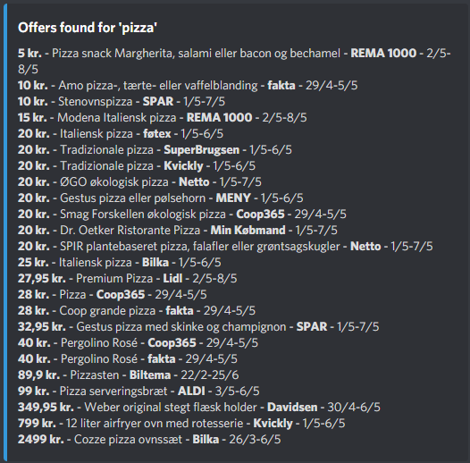

# Dealhunter Discordbot

Set up alarms to get notified when your favorite frozen pizza is on offer. 

## About

Features include:
- Search for items present in any supermarket catalogue for the current week/offer period. (DK stores only)
- Set up alarms when an item/keyword hits a certain price in specified stores. 

## Getting Started

### Configuration

> TODO
> - How to config

### Running the bot

> :warning: Remember to set up configuration first!

#### Run with Docker Compose 🐳

Using release package: The easiest way to run the bot is to download the latest release and run it using Docker Compose.

Using `clone` command: This project uses the Discord bot template from this repository [INSERT LINK]. As such, only the Discord related code for the specific tasks of the `dealhunter-discordbot` is defined here and should be integrated with the template. This is already done in the release packages, but must be done manually if the project is simply cloned. 

> TODO
> - How to build

## Usage

The prefix for all comamnds is `!offers`

### Search

Command: `!offers search "<keywords>" [<stores>]`

Example: `!offers search "modena pizza"`

Currently, the bot only lists the first 24 offers that it finds in the specified store(s) - or _any_ store if the store parameter is omitted.

**Keywords:** The specified keywords are not treated as seperate searches. If multiple keywords are specified, only offers which contain _both_ keywords will show up. 

**Stores:** Check `!offers stores` for valid stores (case insensitive).

### Alarms

Currently, the bot posts as soon as it finds a new offer matching specified keywords.

> TODO
> - How to add an offer alarm/agent 

