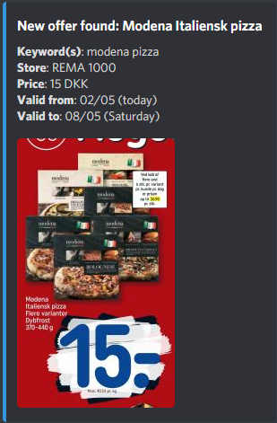

# Dealhunter Discordbot

Set up alarms to get notified when your favorite frozen pizza is on offer. 

## About

Features include:
- Search for items present in any supermarket catalogue for the current week. (DK stores only)
- Set up alarms when an item/keyword hits a certain price in specified stores. 

## Getting Started

### Configuration

### Running the bot

> :warning: Remember to set up configuration first!

## Usage

Current behaviour is that the bot posts as soon as it finds a new offer matching specified keywords: 

